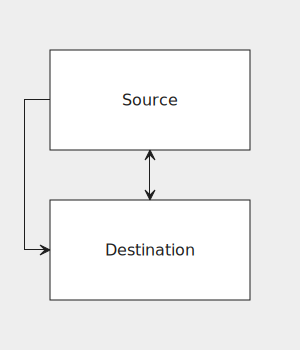
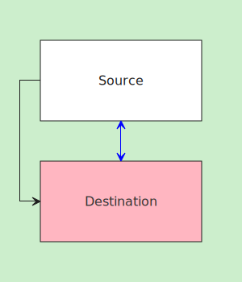

## Styling your flowchart

### SVG output structure

Here's a simple flowchart:

```js
grid {
    src("Source");
    dest("Destination", class: "my-destination");
}

define {
    src(connect: {
        s:n@s(class: "my-south-connection", arrowheads: both);
        w:w@s(class: "my-west-connection");
    });
}
```



Let's look at the generated SVG:

```xml
<svg xmlns="http://www.w3.org/2000/svg" width="300" height="350">
  <style>
    <!-- Some default CSS here -->
  </style>
  <rect class="background" x="0" y="0" width="300" height="350" />

  <g class="nodes">
    <g class="node-wrapper">
      <rect class="rect node" x="50" y="50" width="200" height="100" />
      <text x="150" y="100">Source</text>
    </g>

    <g class="node-wrapper my-destination">
      <rect class="rect node" x="50" y="200" width="200" height="100" />
      <text x="150" y="250">Destination</text>
    </g>
  </g>

  <g class="connections">
    <g class="connection my-south-connection">
      <path class="path" d="M 150 150 L 150 200" />
      <path class="arrowhead start" d="M 150 150 L 145 160 L 150 155 L 155 160 L 150 150" />
      <path class="arrowhead end" d="M 150 200 L 155 190 L 150 195 L 145 190 L 150 200" />
    </g>

    <g class="connection my-west-connection">
      <path class="path" d="M 50 100 L 25 100 L 25 250 L 50 250" />
      <path class="arrowhead end" d="M 50 250 L 40 245 L 45 250 L 40 255 L 50 250" />
    </g>
  </g>
</svg>
```

Various parts of the flowchart are tagged with CSS classes. By default, the flowchart is rendered with some default CSS that targets these classes (that's the `<style>` element above). The default CSS can be omitted by using the `--no-default-css` CLI flag. You can see the exact contents of the default CSS file [here](https://github.com/Asha20/flou/blob/master/crates/flou/src/css/default.css).

The `<rect>` with the `background` class is simply the flowchart's background layer. Other than that, the flowchart consists of two groups: `nodes` and `connections`.

#### Node structure

Each node has the following general shape:

```xml
<g class="node-wrapper my-destination">
  <rect class="rect node" x="50" y="200" width="200" height="100" />
  <text x="150" y="250">Destination</text>
</g>
```

The element with the `node-wrapper` class is the node's root. The element with the `node` class is the shape of the node. This element will also automatically get its shape attached as another CSS class (in this case, `rect`). Finally, the node's root also contains a `<text>` element which holds the node's text. Putting a `class` node attribute like the one on the `dest` node will attach the given CSS class to the node's root.

#### Connection structure

Each connection has the following general shape:

```xml
<g class="connection my-south-connection">
  <path class="path" d="M 150 150 L 150 200" />
  <path class="arrowhead start" d="M 150 150 L 145 160 L 150 155 L 155 160 L 150 150" />
  <path class="arrowhead end" d="M 150 200 L 155 190 L 150 195 L 145 190 L 150 200" />
</g>
```

The structure and CSS classes for connections are similar to those of nodes. `connection` is the connection's root element and `path` is the shape itself. If the connection has any arrowheads, their elements will have the `arrowhead` class along with their position as another CSS class. Putting a `class` connection attribute will attach the class to the connection's root.

### Embedding CSS 


Let's write a custom CSS file called `index.css` that will modify the default CSS as well as target the custom CSS classes we attached to our nodes and connections:

```css
/* Override default CSS */
.background {
    fill: #cec;
}

/* Custom classes */
.my-destination .node {
    fill: lightpink;
}

.my-destination text {
    fill: #333;
}

.my-south-connection .path,
.my-south-connection .arrowhead {
    fill: blue;
    stroke: blue;
}
```

We can use the `--css` CLI option to embed one or more CSS files into the resulting SVG:

    $ flou input.svg -o output.svg --css index.css

This is the result:

