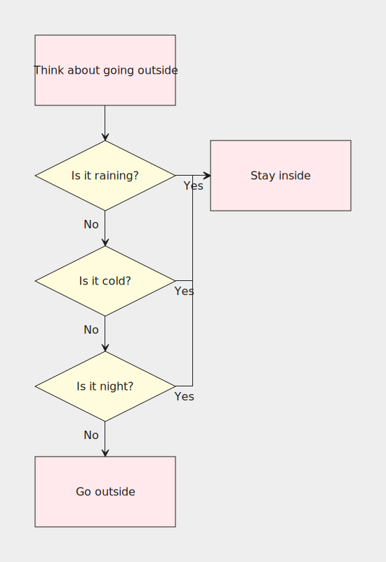
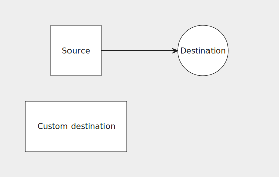
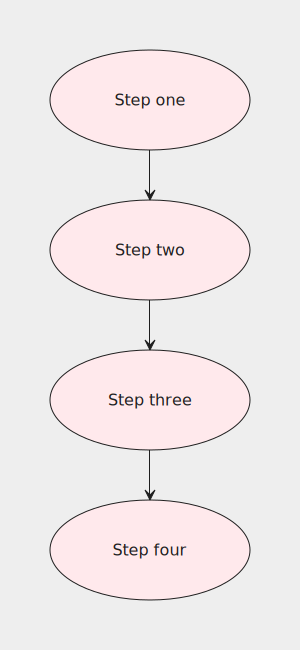

## Using a define block

Let's take a look at the following flowchart:

```js
grid {
    block("Think about going outside", class: "pink", connect: s:n@s);
    condition("Is it raining?", shape: diamond, class: "yellow", connect: { s:n@s("No"); e:w#stay("Yes") }), block#stay("Stay inside", class: "pink");
    condition("Is it cold?", shape: diamond, class: "yellow", connect: { s:n@s("No"); e:w#stay("Yes") });
    condition("Is it night?", shape: diamond, class: "yellow", connect: { s:n@s("No"); e:w#stay("Yes") });
    block("Go outside", class: "pink");
}
```



This flowchart has lots of repetition going on, which means:

- It's harder to read
- If you want to change something, you need to change it in multiple places
- Long lines make it hard to figure out how many columns there are in a row

We can rewrite the example like so:

```js
grid {
    block("Think about going outside", connect: s:n@s);
    condition("Is it raining?"),                           block#stay("Stay inside");
    condition("Is it cold?");
    condition("Is it night?");
    block("Go outside");
}

define {
    block(class: "pink");
    condition(shape: diamond, class: "yellow", connect: {
        s:n@s("No");
        e:w#stay("Yes");
    });
}
```

*Definitions* are a mechanism for reusing common attributes. They belong in the optional `define` block and are separated by semicolons. They are specified in the same way as nodes in `grid`, with one exception being that labels can't be attached to identifiers inside `define`. Attributes specified for an identifier in `define` will apply to all nodes with the same identifier in `grid`.

Apart from using the `define` block to put shared attributes in one place, a valid use-case could also be putting a node's long list of attributes in `define` so as to reduce clutter in `grid`, making it more readable.

It can also be convenient to put the `connect` attribute in `define` if there are multiple connections so that they can be spread across multiple lines for improved readability like in the example above. The same could be done in `grid`, though it's generally not a good idea since it makes it harder to tell how many rows the grid has.

### Overwriting

If a node has the same attribute defined in `grid` and in `define`, the value in `grid` will overwrite the one in `define`:

```js
grid {
    src("Source", connect: e:w@e),              dest;
    dest("Custom destination", shape: rect);
}

define {
    src(shape: square, connect: {s:n@s, e:w@e});
    dest("Destination", shape: circle);
}
```



As an example of where this can come in handy, say we wanted all `block` nodes connect to the node below them except for the last one. This can be achieved by overriding its `connect` to an empty list:

```js
grid {
    block("Step one");
    block("Step two");
    block("Step three");
    block("Step four", connect: {});
}

define {
    block(shape: ellipse, class: "pink", connect: s:n@s);
}
```



