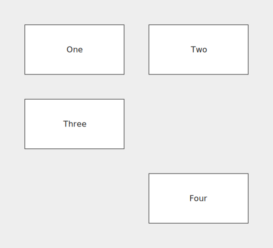

## Hello World!

Let's create our first flowchart:

```js
grid {
    // This is a comment
    block(text: "Hello World!", shape: rect);
}
```


In Flou, all flowcharts are represented with a *grid*. The basic building blocks of grids are *nodes*. Our Hello World flowchart has a single node. `block` is that node's *identifier*. `block` is completely arbitrary and can be replaced with anything else. We'll talk more about identifiers and why they're useful later. Other than the identifier, we've included some basic *attributes* on our node. Also, line-comments can be defined using `//`.

### Shorthands

Since `text` is the most commonly used attribute, it has a convenient shorthand. We could use the following form and get the same result:

```js
grid {
    block("Hello World!", shape: rect);
}
```

When using the text shorthand, the text string needs to be the first element of the attribute list. For example, this is invalid:
 
```js
grid {
    block(shape: rect, "Hello World!");
}
```

Rectangle is the default node shape, so we could also omit the `shape` attribute:

```js
grid {
    block("Hello World!");
}
```

### More nodes

A flowchart with a single node isn't that interesting to look at, so let's add some more nodes. Grid rows are separated with a semicolon, while grid columns are separated with a comma. If you want to leave some space intentionally empty like in the third row, use the special `_` node.

```js
grid {
    block("One"),     block("Two");
    block("Three");
    _,                block("Four");
}
```



