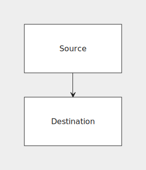
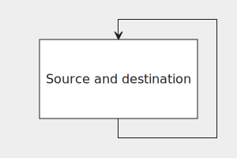
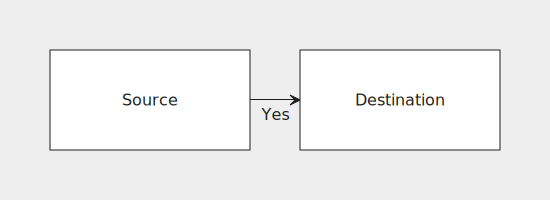
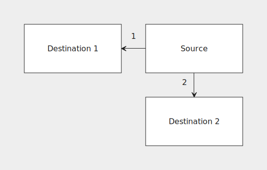

## Making connections


### Absolute connections

Here's a flowchart with two connected nodes:

```js
grid {
    block("Source", connect: s:n#dest);
    block#dest("Destination");
}
```



We've attached `#dest` to the destination node's identifier. This is called a *label*. Two nodes cannot have the same label. The connection itself is represented with a `connect` attribute on the source node. The connection declaration above can be split into two parts: `s:n` and `#dest`.

- `s:n` means that we'd like to connect the **south** side of the source node to the **north** side of the destination node.
- `#dest` is the destination. Here it means that the destination node is the one with the label `dest`.


### Relative connections

Keeping track of multiple labels is tedious and error-prone. We could simplify the previous example like so:

```js
grid {
    block("Source", connect: s:n@s);
    block("Destination");
}
```

Instead of a label on the destination node we used `@s` as the connection destination, meaning "the node directly **south** of me". Relative connections are easier to understand and don't require labels, but can't represent all possible connections like absolute ones can.


### Self connection

A node can be connected to itself by omitting the direction and using just `@`, like so:

```js
grid {
    block("Source and destination", connect: s:n@);
}
```




### Connection attributes

Certain attributes can be set on connections just like on nodes. Here's an example:

```js
grid {
    block("Source", connect: e:w@e("Yes")), block("Destination");
}
```



### Multiple connections

A node may also define multiple connections like so:

```js
grid {
    block("Destination 1"), block("Source", connect: { w:e@w("1"); s:n@s("2") });
    _,                      block("Destination 2");
}
```

